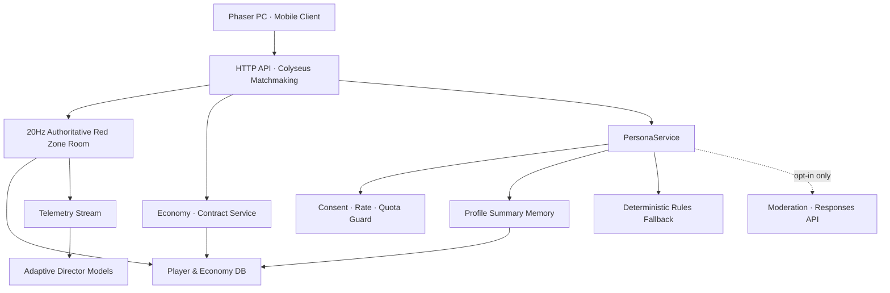

# AI 및 라이브 서비스 아키텍처

## 원칙

LLM이 게임 월드를 직접 조작하지 않습니다. 모델 출력은 구조화된 의도 후보이며, 서버의 정책·권한·쿨다운 검증을 통과한 명령만 게임 시뮬레이션에 전달됩니다. 실시간 전투는 로컬/서버 결정론 로직으로 계속 동작하므로 AI 제공자 장애가 전투를 중단시키지 않습니다.

## 현재 구현 구성



현재 구현은 단일 Node 프로세스 안에 HTTP API와 Colyseus 게임룸을 모듈 형태로 배치합니다. `DATABASE_URL`이 있으면 PostgreSQL을, 없으면 개발용 메모리 저장소를 사용합니다. `REDIS_URL`이 있으면 매칭 드라이버와 Presence가 Redis로 전환되어 여러 게임서버 인스턴스를 운영할 수 있습니다.

비정상 연결 종료 시 서버는 20초 동안 같은 세션 ID와 전투 상태·현장 화물을 보존하고 입력을 즉시 중립화합니다. 클라이언트는 지수 백오프로 같은 룸에 자동 재접속하며, 예약이 만료되면 인증 토큰으로 새 세션을 최대 5회 복구합니다. 최종 실패 후에만 현재 화면을 로컬 훈련 판정으로 전환해 네트워크 단절 중 중복 전투 계산을 막습니다.

분대 편성은 `POST /api/profile/squad`에서 보유 여부, 3인 정원, 중복을 검증한 뒤 프로필 트랜잭션으로 저장합니다. 게임룸 입장 시 확정된 분대를 읽어 공용 `calculateSquadBonuses` 규칙을 권위형 시뮬레이션에 적용하므로 클라이언트가 전투 보너스를 임의로 조작할 수 없습니다.

장비 제작은 `POST /api/economy/gear/craft`, 장착은 `POST /api/profile/gear`를 사용합니다. 제작은 워크숍 레벨·보유 재화·중복·멱등 키를 검증하고, 장착은 소유권·중복·2슬롯 제한을 검증합니다. 룸 참가와 `sync-loadout` 시 서버 프로필을 다시 읽어 공용 `calculateCombatBonuses` 결과를 적용하므로 분대와 장비 효과가 오프라인 훈련과 온라인 전투에서 같은 수치로 동작합니다.

캠페인 진행은 프로필의 `campaign.completedOperations`에 순서대로 저장합니다. 매칭 옵션의 `operationId`는 서버가 해금 상태와 대조하며, Colyseus 매치메이커는 같은 작전 ID의 플레이어만 한 방에 배치합니다. 보스 격파 후 추출이 확정되면 작전 보상과 해금도 별도의 멱등 키를 가진 트랜잭션으로 1회만 적용됩니다.

계약은 `packages/shared/src/contracts.ts`가 편성·목표·보상·서울 시간 초기화의 단일 기준을 제공합니다. 온라인 전투는 추출 확정 시 직전 추출 이후 처치 수, 화물과 작전 완료를 `EconomyService`에 전달하고 서버 프로필의 일일·주간 진행도를 같은 경제 트랜잭션으로 갱신합니다. `GET /api/contracts`는 현재 보드를, `POST /api/contracts/:contractId/claim`은 완료·활성·중복을 검증한 보상 결과를 반환합니다.

딥 토크는 `PersonaService`가 플레이어별 요청을 직렬화한 뒤 보유 캐릭터, 멱등 키, 분당 4회 제한, 외부 AI 동의와 일일 상한을 검증합니다. 키가 없거나 제공자 장애·타임아웃·할당량 초과가 발생하면 동일한 API 계약으로 결정론적 규칙 응답을 반환합니다. 입력 또는 출력 안전 필터가 차단한 요청만 `422`로 닫고 프로필 기억을 변경하지 않습니다.

## 권위형 전투 프로토콜

클라이언트는 50ms 간격으로 결과가 아닌 입력을 보냅니다.

```json
{
  "sequence": 1821,
  "moveX": 0.7,
  "moveY": -0.3,
  "aimAngle": 1.82,
  "fire": true,
  "extract": false,
  "dash": true,
  "activateLink": false
}
```

서버는 순서가 과거인 입력을 폐기하고 이동량, 회피 거리·쿨다운, 발사 간격, 조준각, 사거리, 자원 습득, 추출 거리와 뉴럴 링크 조건을 검증합니다. `packages/shared/src/world.ts`가 작전별 하드 커버 사각형, 탈출·중계기 좌표, 원형 이동 충돌과 시야선 교차를 단일 기준으로 제공합니다. 클라이언트 예측과 서버 시뮬레이션은 같은 기하를 사용하므로 일반 이동과 회피가 벽을 통과하지 않고, 엄폐물 뒤 표적은 사격 판정에서 제외됩니다. 적은 시야가 막히면 고정된 방향으로 측면 이동을 시도합니다.

확정 상태만 Colyseus Schema의 변경분 동기화로 클라이언트에 전달됩니다. 클라이언트는 자기 캐릭터를 예측 이동한 후 서버 위치로 점진적으로 보정합니다.

클라이언트 렌더러는 2초 단위 실측 FPS를 사용해 `HIGH/BALANCED/LOW` 품질을 자동 선택합니다. HUD DOM 갱신은 품질에 따라 80~150ms 간격으로 제한하며, 총구 화염과 피격 파티클은 고정 크기 풀에서 재사용합니다. 그래픽 품질 조절은 연출량과 표시 주기만 바꾸며 전투·경제 판정 수치는 바꾸지 않습니다.

## 경제 저장

- `players`: 현재 프로필 JSONB와 마지막 접속 시간
- `economy_events`: 요청 키, 이벤트 유형, 처리 결과
- 모집·쉘터·방치·추출·장비 제작·계약 수령은 `SELECT ... FOR UPDATE` 트랜잭션
- 동일 플레이어/요청 키는 유일 제약으로 한 번만 처리
- 전투 좌표는 DB에 매 틱 기록하지 않고 게임룸 메모리에 유지
- 추출·사망·구매 같은 확정 지점에서만 영구 저장

## 개인정보 경계

- 선택 분석은 기본 비활성이고 기기 설정에서 명시적으로 켠 경우에만 전송
- 전술 명령과 캐릭터 대화 원문은 분석 이벤트에서 제외
- 외부 AI는 서버와 요청 양쪽 동의가 모두 참일 때만 사용하고, 키는 서버에만 보관
- 프로필에는 대화 전체가 아니라 길이가 제한된 요약 기억과 마지막 응답만 저장
- 캐릭터별 기억 삭제, 동의 철회, 계정 내보내기·삭제 제공
- `GET /api/account/export`로 서버 프로필과 데이터 사용 설명을 내려받음
- `DELETE /api/account`는 직접 `DELETE` 확인값을 요구하고 진행·분석 데이터를 삭제
- 결제 거래 식별자는 삭제 계정과 분리해 중복 지급 방지 원장으로 유지
- 프로덕션 서버는 명시적 `JWT_SECRET`, `DATABASE_URL`, `CORS_ORIGIN` 없이는 시작 거부

게스트 인증은 현재 기기 식별자와 30일 JWT를 사용합니다. 이는 개발/알파용이며 출시 전 Steam, Google, Apple 계정 연결과 토큰 회전·폐기 기능을 추가해야 합니다.

## 대화 처리 순서

1. 클라이언트가 텍스트, 캐릭터 ID, 요청별 외부 AI 사용 의사와 멱등 키를 보냅니다.
2. 서버가 인증, 캐릭터 소유권, 입력 길이, 속도 제한, 저장된 동의와 일일 상한을 확인합니다.
3. 외부 AI를 사용하면 입력 안전 검사 후 캐릭터 설정과 최근 요약 기억을 Responses API에 `store: false`로 보냅니다.
4. 서버가 출력 안전 검사를 통과한 320자 이하 대사만 반환합니다.
5. 제공자 장애·타임아웃·키 없음·일일 상한에서는 규칙 기반 페르소나가 즉시 대체합니다.
6. 안전 차단이 아니면 길이가 제한된 요약 기억, 마지막 응답, 처리 방식과 사용량을 서버 프로필에 저장합니다.
7. 사용자는 캐릭터별 기억을 지우거나 외부 AI 동의를 철회하고 계정 데이터를 내보내거나 삭제할 수 있습니다.

## 명령 계약 예시

```json
{
  "intent": "FLANK",
  "targetEntityId": "enemy_218",
  "urgency": 0.72,
  "spokenReply": "측면 경로 확인. 사각으로 진입합니다."
}
```

허용되지 않은 동작, 존재하지 않는 대상, 임계치를 벗어난 수치는 폐기하고 로컬 폴백으로 전환합니다.

## 적응형 AI 단계

1. 현재 구현: 규칙 기반 실시간 텔레메트리 가중치 조절
2. 오프라인 시뮬레이션: 봇 플레이로 웨이브 조합 밸런싱
3. Contextual bandit: 세션 만족도·실패 원인을 보상으로 사용
4. 제한적 강화학습: 라이브 유저가 아닌 샌드박스에서 정책 학습 후 검증된 파라미터만 배포

라이브 플레이 중 온라인 강화학습으로 적이 무제한 진화하도록 두지 않습니다. 재현성, 공정성, QA를 위해 정책 버전과 상한선을 고정합니다.

## 보안과 비용

- 제공자 키는 서버 비밀 저장소에만 보관
- 계정·경제·가챠 결과는 서버 권위형 처리
- 프롬프트 인젝션과 부적절한 롤플레이에 대한 입력/출력 정책 적용
- 180 출력 토큰, 8초 타임아웃, 분당 4회, 기본 일일 12회 상한으로 비용 제어
- 비공개 알파에서는 과금 등급과 무관하게 같은 안전·기억 기능 제공
- 아동·청소년 계정은 로맨스/집착 페르소나 비활성화
