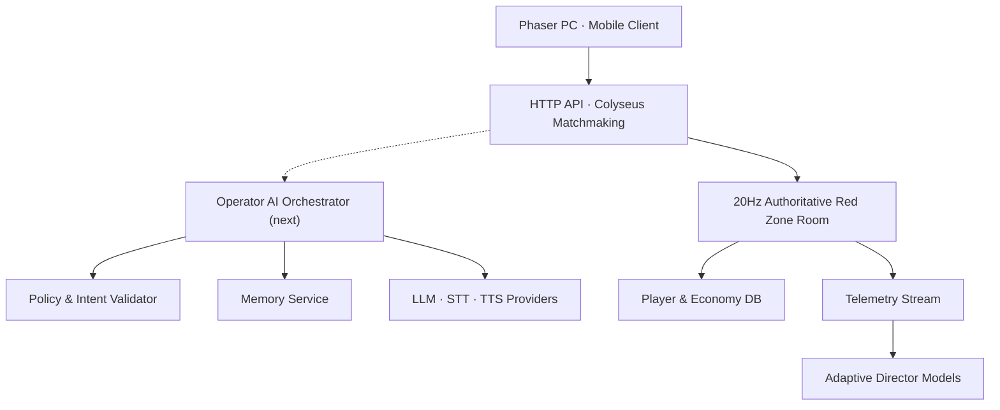

# AI 및 라이브 서비스 아키텍처

## 원칙

LLM이 게임 월드를 직접 조작하지 않습니다. 모델 출력은 구조화된 의도 후보이며, 서버의 정책·권한·쿨다운 검증을 통과한 명령만 게임 시뮬레이션에 전달됩니다. 실시간 전투는 로컬/서버 결정론 로직으로 계속 동작하므로 AI 제공자 장애가 전투를 중단시키지 않습니다.

## 현재 구현 구성



현재 구현은 단일 Node 프로세스 안에 HTTP API와 Colyseus 게임룸을 모듈 형태로 배치합니다. `DATABASE_URL`이 있으면 PostgreSQL을, 없으면 개발용 메모리 저장소를 사용합니다. `REDIS_URL`이 있으면 매칭 드라이버와 Presence가 Redis로 전환되어 여러 게임서버 인스턴스를 운영할 수 있습니다.

분대 편성은 `POST /api/profile/squad`에서 보유 여부, 3인 정원, 중복을 검증한 뒤 프로필 트랜잭션으로 저장합니다. 게임룸 입장 시 확정된 분대를 읽어 공용 `calculateSquadBonuses` 규칙을 권위형 시뮬레이션에 적용하므로 클라이언트가 전투 보너스를 임의로 조작할 수 없습니다.

## 권위형 전투 프로토콜

클라이언트는 50ms 간격으로 결과가 아닌 입력을 보냅니다.

```json
{
  "sequence": 1821,
  "moveX": 0.7,
  "moveY": -0.3,
  "aimAngle": 1.82,
  "fire": true,
  "extract": false,
  "dash": true,
  "activateLink": false
}
```

서버는 순서가 과거인 입력을 폐기하고 이동량, 회피 거리·쿨다운, 발사 간격, 조준각, 사거리, 자원 습득, 추출 거리와 뉴럴 링크 조건을 검증합니다. 확정 상태만 Colyseus Schema의 변경분 동기화로 클라이언트에 전달됩니다. 클라이언트는 자기 캐릭터를 예측 이동한 후 서버 위치로 점진적으로 보정합니다.

## 경제 저장

- `players`: 현재 프로필 JSONB와 마지막 접속 시간
- `economy_events`: 요청 키, 이벤트 유형, 처리 결과
- 모집·쉘터·방치·추출은 `SELECT ... FOR UPDATE` 트랜잭션
- 동일 플레이어/요청 키는 유일 제약으로 한 번만 처리
- 전투 좌표는 DB에 매 틱 기록하지 않고 게임룸 메모리에 유지
- 추출·사망·구매 같은 확정 지점에서만 영구 저장

## 개인정보 경계

- 선택 분석은 기본 비활성이고 기기 설정에서 명시적으로 켠 경우에만 전송
- 전술 명령과 캐릭터 대화 원문은 분석 이벤트에서 제외
- `GET /api/account/export`로 서버 프로필과 데이터 사용 설명을 내려받음
- `DELETE /api/account`는 직접 `DELETE` 확인값을 요구하고 진행·분석 데이터를 삭제
- 결제 거래 식별자는 삭제 계정과 분리해 중복 지급 방지 원장으로 유지
- 프로덕션 서버는 명시적 `JWT_SECRET`, `DATABASE_URL`, `CORS_ORIGIN` 없이는 시작 거부

게스트 인증은 현재 기기 식별자와 30일 JWT를 사용합니다. 이는 개발/알파용이며 출시 전 Steam, Google, Apple 계정 연결과 토큰 회전·폐기 기능을 추가해야 합니다.

## 대화 처리 순서

1. 클라이언트가 음성 또는 텍스트와 최소 전투 문맥을 전송합니다.
2. STT가 음성을 텍스트로 바꾸고 PII 필터가 민감 정보를 제거합니다.
3. 오케스트레이터가 캐릭터 설정, 허용된 기억 요약, 현재 전투 상태를 조합합니다.
4. 모델은 대사와 제한된 `TacticalIntent` JSON을 반환합니다.
5. 검증기가 스키마, 대상, 거리, 쿨다운, 권한을 확인합니다.
6. 게임 서비스가 승인된 명령만 수행하고 결과 이벤트를 반환합니다.
7. 원문 전체가 아닌 요약된 기억 후보를 저장하며, 사용자가 열람·삭제할 수 있습니다.

## 명령 계약 예시

```json
{
  "intent": "FLANK",
  "targetEntityId": "enemy_218",
  "urgency": 0.72,
  "spokenReply": "측면 경로 확인. 사각으로 진입합니다."
}
```

허용되지 않은 동작, 존재하지 않는 대상, 임계치를 벗어난 수치는 폐기하고 로컬 폴백으로 전환합니다.

## 적응형 AI 단계

1. 현재 구현: 규칙 기반 실시간 텔레메트리 가중치 조절
2. 오프라인 시뮬레이션: 봇 플레이로 웨이브 조합 밸런싱
3. Contextual bandit: 세션 만족도·실패 원인을 보상으로 사용
4. 제한적 강화학습: 라이브 유저가 아닌 샌드박스에서 정책 학습 후 검증된 파라미터만 배포

라이브 플레이 중 온라인 강화학습으로 적이 무제한 진화하도록 두지 않습니다. 재현성, 공정성, QA를 위해 정책 버전과 상한선을 고정합니다.

## 보안과 비용

- 제공자 키는 서버 비밀 저장소에만 보관
- 계정·경제·가챠 결과는 서버 권위형 처리
- 프롬프트 인젝션과 부적절한 롤플레이에 대한 입력/출력 정책 적용
- 대화 캐시, 짧은 전투 응답용 소형 모델, 비동기 기억 요약으로 비용 제어
- 무료/구독 요금제 모두 명확한 호출 한도와 비용 상한 적용
- 아동·청소년 계정은 로맨스/집착 페르소나 비활성화
