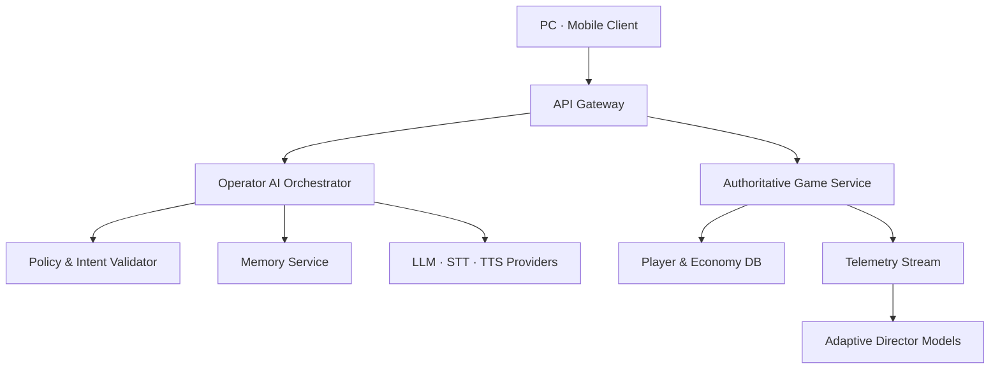

# AI 및 라이브 서비스 아키텍처

## 원칙

LLM이 게임 월드를 직접 조작하지 않습니다. 모델 출력은 구조화된 의도 후보이며, 서버의 정책·권한·쿨다운 검증을 통과한 명령만 게임 시뮬레이션에 전달됩니다. 실시간 전투는 로컬/서버 결정론 로직으로 계속 동작하므로 AI 제공자 장애가 전투를 중단시키지 않습니다.

## 목표 구성



## 대화 처리 순서

1. 클라이언트가 음성 또는 텍스트와 최소 전투 문맥을 전송합니다.
2. STT가 음성을 텍스트로 바꾸고 PII 필터가 민감 정보를 제거합니다.
3. 오케스트레이터가 캐릭터 설정, 허용된 기억 요약, 현재 전투 상태를 조합합니다.
4. 모델은 대사와 제한된 `TacticalIntent` JSON을 반환합니다.
5. 검증기가 스키마, 대상, 거리, 쿨다운, 권한을 확인합니다.
6. 게임 서비스가 승인된 명령만 수행하고 결과 이벤트를 반환합니다.
7. 원문 전체가 아닌 요약된 기억 후보를 저장하며, 사용자가 열람·삭제할 수 있습니다.

## 명령 계약 예시

```json
{
  "intent": "FLANK",
  "targetEntityId": "enemy_218",
  "urgency": 0.72,
  "spokenReply": "측면 경로 확인. 사각으로 진입합니다."
}
```

허용되지 않은 동작, 존재하지 않는 대상, 임계치를 벗어난 수치는 폐기하고 로컬 폴백으로 전환합니다.

## 적응형 AI 단계

1. 현재 구현: 규칙 기반 실시간 텔레메트리 가중치 조절
2. 오프라인 시뮬레이션: 봇 플레이로 웨이브 조합 밸런싱
3. Contextual bandit: 세션 만족도·실패 원인을 보상으로 사용
4. 제한적 강화학습: 라이브 유저가 아닌 샌드박스에서 정책 학습 후 검증된 파라미터만 배포

라이브 플레이 중 온라인 강화학습으로 적이 무제한 진화하도록 두지 않습니다. 재현성, 공정성, QA를 위해 정책 버전과 상한선을 고정합니다.

## 보안과 비용

- 제공자 키는 서버 비밀 저장소에만 보관
- 계정·경제·가챠 결과는 서버 권위형 처리
- 프롬프트 인젝션과 부적절한 롤플레이에 대한 입력/출력 정책 적용
- 대화 캐시, 짧은 전투 응답용 소형 모델, 비동기 기억 요약으로 비용 제어
- 무료/구독 요금제 모두 명확한 호출 한도와 비용 상한 적용
- 아동·청소년 계정은 로맨스/집착 페르소나 비활성화
